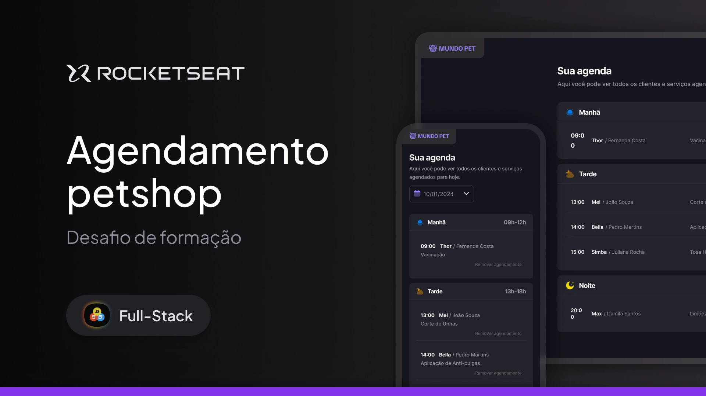

<p align="center">
  
</p>

<p align="center">
  PetLife — Aplicação web para agendamento de serviços pet, com comunicação em tempo real via API (CRUD completo) e manipulação avançada de DOM.
</p>

<p align="center">
  <a href="#-tecnologias">Tecnologias</a>&nbsp;&nbsp;&nbsp;|&nbsp;&nbsp;&nbsp;
  <a href="#-projeto">Projeto</a>&nbsp;&nbsp;&nbsp;|&nbsp;&nbsp;&nbsp;
  <a href="#-como-executar">Como Executar</a>&nbsp;&nbsp;&nbsp;|&nbsp;&nbsp;&nbsp;
  <a href="#-design">Design</a>&nbsp;&nbsp;&nbsp;|&nbsp;&nbsp;&nbsp;
  <a href="#memo-licença">Licença</a>
</p>

<p align="center">
  
</p>

<br>

<p align="center">
  <a href="https://github.com/novaesdg/petlife/">
  
  </a>
</p>

## 🚀 Tecnologias

Esse projeto foi desenvolvido com as seguintes tecnologias:

- HTML & CSS
- JavaScript Vanilla
- [Vite](https://vitejs.dev/)
- [JSON Server](https://github.com/typicode/json-server) (Mock de banco de dados REST)
- [Day.js](https://day.js.org/) (Manipulação e formatação de datas)

## 💻 Projeto

O PetLife é uma Single Page Application (SPA) desenvolvida para gerenciar a agenda de um Pet Shop. O sistema permite criar novos agendamentos, filtrar horários por datas específicas usando um calendário interativo e remover atendimentos finalizados.

## ⚙️ Como Executar

Como este projeto utiliza o `json-server` para simular uma API REST e um banco de dados, o deploy estático comum (como GitHub Pages) não suporta as rotas de gravação e exclusão. Para testar todas as funcionalidades (CRUD), é necessário rodar o projeto localmente.

**1. Clone o repositório:**
```bash
git clone https://github.com/novaesdg/petlife.git
cd petlife 
```
**2. Instale as dependências:**
```bash
npm install
```
**3. Inicie o servidor da API (Banco de Dados):**
Em um terminal, rode o comando abaixo para iniciar o JSON Server na porta 3333:
```bash
npm run server
# ou, dependendo da configuração do seu package.json:
npx json-server db.json -p 3333
```
**4. Inicie o Front-end (Vite):**
Abra um novo terminal (mantenha o da API rodando) e inicie a aplicação:
```bash
npm run dev
```
Acesse o link gerado no terminal (geralmente http://localhost:5173) para usar o sistema completo!

## 🎨 Design
O layout e o design (Figma) deste projeto foram idealizados e disponibilizados pela Rocketseat. 
A codificação, arquitetura de pastas e implementação lógica (HTML, CSS e JavaScript) foram desenvolvidas inteiramente por mim.

___

Made by Diogo Novaes 👋🏽 [Get in Touch!](https://www.linkedin.com/in/diogonovaesc/)
